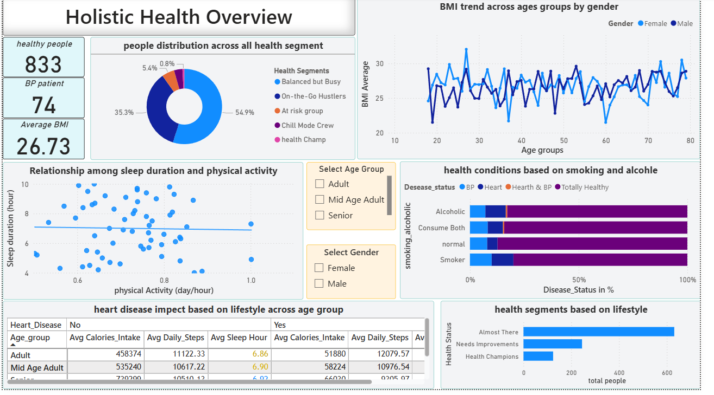

# 🩺 Holistic Health Overview

## 🎯 Objective
This Power BI project provides a holistic snapshot of individual and group health, uncovering insights into lifestyle, activity, and health segment trends. The dashboard helps users and analysts quickly identify patterns among age, gender, physical activity, sleep, heart health, and habits such as smoking and alcohol—enabling better wellness decisions and targeted interventions.

---

## 🧩 Dataset Overview
The dataset (`health_activity_data.csv`) records comprehensive health and lifestyle metrics for a diverse set of individuals, with columns including:
- **Age & Gender**
- **Height, Weight, BMI (Body Mass Index)**
- **Daily Steps & Calories Intake**
- **Sleep Duration (hours per night)**
- **Heart Rate & Blood Pressure**  
- **Exercise Hours per Week**
- **Smoking & Alcohol Habits**
- **Diabetic & Heart Disease Status**

This data supports deep dives into how lifestyle affects health across segments (e.g., Balanced but Busy, At Risk, Health Champs, etc.), highlighting what factors correlate with positive health outcomes.

---

## 💡 Dashboard Summary
- 🧑‍🤝‍🧑 **Health Segments:** Visualizes how the population distributes across lifestyle-based health groups (such as "Balanced but Busy" and "At Risk").
- 📈 **BMI Trends:** Tracks BMI across age and gender, revealing group risks and healthy ranges.
- 😴 **Sleep & Activity:** Examines links between sleep duration and activity, indicating which routines support better health.
- 🚬🍷 **Smoking/Alcohol Impact:** Shows the influence of smoking and alcohol habits on conditions like blood pressure and heart disease.
- ❤️ **Lifestyle & Disease:** Illuminates how steps, calorie intake, exercise, and rest correlate with the risk for heart and metabolic ailments.

---

## 🖼️ Dashboard Preview

---

## 👨‍💻 About Me & Connect

A motivated data enthusiast, **Parveen Jalwal**, focused on transforming complex datasets into actionable business intelligence. Actively seeking opportunities in analytics and business intelligence roles, with a portfolio that demonstrates insight generation and effective storytelling.

**Let's connect for collaborations or opportunities:**
- 📧 Gmail: `parveenjangra0952@gmail.com`
* **Connect with me on LinkedIn:** [Parveen Jalwal](https://www.linkedin.com/in/parveen-jalwal-201a2a302)
